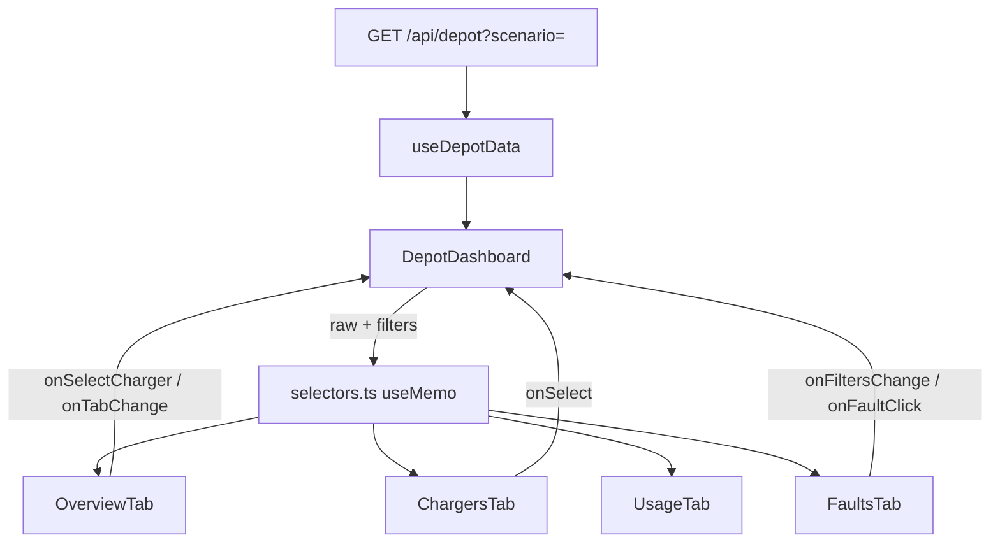

# Part A — Design Document

**fluxton · EV Depot Management Dashboard**

A single-screen dashboard for depot managers operating EV charging infrastructure: monitor charger health, track live sessions, surface faults, and review 7-day usage — without leaving one application shell.

This document was written **before implementation** and updated to reflect the shipped architecture. Bullet points and ASCII sketches are intentional; clarity over polish.

---

## Problem statement

Depot managers need one place to answer four questions, in order:

1. **Is anything broken right now?** (faulted / offline chargers)
2. **What is running?** (active sessions, live power)
3. **How much energy moved today / this week?** (kWh, session counts)
4. **What happened historically?** (fault log, 7-day usage trend)

The dashboard must support:

- Charger overview with status: available, charging, faulted, offline
- Detail panel for a selected charger (session metrics + fault history)
- Depot-level summary (counts, energy, active sessions)
- 7-day usage chart (sessions + energy on one chart)
- Filterable fault log (charger, fault type multiselect, date range)

Component structure, data fetching, and layout are **our choices** — documented below with explicit assumptions.

---

## What we optimised for (assessment weighting)

| Priority | How this repo addresses it |
|----------|----------------------------|
| **Component architecture** | Tab shell + focused views; pure selectors layer; presentational leaf components |
| **Data transformation** | All aggregation in `src/lib/selectors.ts` — power derived as P = V × I, zero-filled chart buckets |
| **Information hierarchy** | Overview defaults to problems-first; faulted/offline sort to top everywhere |
| **Edge cases** | Four named mock scenarios + empty states in every view |
| **Code clarity** | One-way data flow, memoised derivations, no duplicate state |

Visual polish (motion, glow, asymmetrical widgets) is secondary and layered on top without changing the data model.

---

## A1. Component structure

### Major components and relationships

```
RootLayout (fonts, dawn-glow canvas)
└── page.tsx
    └── DepotDashboard                 ← single owner of UI state + URL sync
        ├── IconRail                   slim icon nav (Overview · Chargers · Usage · Faults)
        ├── AppHeader                  welcome, status pill, tabs, time filter, demo dataset
        └── TabPanel (animated swap)
            ├── OverviewTab            KPI tiles → problems → health → usage preview
            ├── ChargersTab            filter chips + list/detail split
            │   ├── ChargerListRow     compact row (status dot + label + live kW)
            │   └── ChargerDetailPanel active / idle / faulted / offline + recent faults
            ├── UsageTab                 full-width UsageChart
            └── FaultsTab                FaultLog wrapper
                └── FaultLog             combining filters + table + empty states
```

**Shared primitives** (`src/components/ui/`): `StatusBadge`, `StatusDot`, `StatusIcon`, `EmptyState`, `GlassCard`, `Pill`, `RadialGauge`, `icons`.

**Motion primitives** (`src/components/motion/`): `AnimatedCard`, `AnimatedCounter`, `TabPanel`, `StaggerList` — presentation only; no business logic.

**Domain + transforms** (`src/lib/`): `types.ts`, `selectors.ts`, `time.ts`, `format.ts`, `constants.ts`, `mock/`.

**Data boundary** (`src/hooks/useDepotData.ts`): fetches `/api/depot?scenario=` once per scenario change.

### Why tabbed navigation instead of one long scroll

The brief allows layout freedom. We chose **tabs + icon rail** because:

- A depot manager's task is **mode-based** (scan problems → drill into one charger → review usage → triage faults).
- Tabs keep the Chargers list/detail split visible without pushing the fault log below the fold.
- URL-synced tabs (`?tab=`) make demos and review reproducible.

Each tab maps 1:1 to a requirement block in Part B.

### State flow — where it lives and why

State is **shallow and centralised** in `DepotDashboard`. Child components are controlled and raise events upward.

| State | Owner | Persisted? | Why here |
|-------|-------|------------|----------|
| Raw `DepotData` | `useDepotData` | No (refetched on scenario change) | Single fetch boundary mimics a real API |
| `scenario` | `DepotDashboard` | URL `?scenario=` | Edge-case demos without code edits |
| `activeTab` | `DepotDashboard` | URL `?tab=` | Shareable navigation state |
| `selectedChargerId` | `DepotDashboard` | No | Drives detail panel on Chargers tab |
| `timeRangeId` | `DepotDashboard` | No | Recomputes energy/session KPIs |
| `faultFilters` | `DepotDashboard` | No | Combining filters for fault log |
| `chargerFilter` | `DepotDashboard` | No | Deep-link filter when navigating from Overview |

**Derived values are never stored.** `useMemo` runs pure selectors:

- `getDepotSummary(data, timeRangeId)`
- `getUsageSeries(data.sessions, 7)`
- `getChargerDetail(charger, sessions, faults)`
- `filterFaults(faults, faultFilters)`
- `sortChargersByPriority(chargers, STATUS_PRIORITY)`

This avoids stale duplicates and keeps transformations testable in isolation.



### Cross-tab navigation (information scent)

Click targets wired in `DepotDashboard`:

| User action | Result |
|-------------|--------|
| Overview KPI tile | Jump to relevant tab (often with filter) |
| Needs-attention row | `?tab=chargers` + select that charger |
| Fault log row click | Chargers tab + select fault's charger |
| Overview usage preview | Usage tab |

### Assumptions about the manager and data

- **One depot per screen.** No multi-depot switcher; depot name is display-only.
- **Charger `status` is authoritative.** A live session is a `Session` with no `endedAt`; `activeSessionId` on the charger is a convenience link.
- **Power is never stored** on sessions — always derived `P = V × I` in selectors so mock data cannot contradict the UI.
- **"Today" = local calendar day** (midnight boundary). Usage chart uses **7 calendar days including today**.
- **No websockets.** Offline chargers expose `lastSeenAt` as stale heartbeat; active session duration ticks locally at 1 Hz.
- **Manager priority = problems first.** Faulted and offline units sort above charging and available everywhere lists appear.

---

## A2. Data model

### Raw entities (`src/lib/types.ts`)

```ts
Charger {
  id, label, connectorType, maxPowerKw,
  status: "available" | "charging" | "faulted" | "offline",
  lastSeenAt,           // ISO — "last seen" for offline
  activeSessionId?      // present while charging
}

Session {
  id, chargerId, startedAt, endedAt?,   // endedAt absent => live
  outputVoltageV, outputCurrentA,        // instantaneous readings
  energyDeliveredKwh                     // cumulative this session
}

Fault {
  id, chargerId, type, severity, timestamp, message
}

DepotData { depotId, depotName, chargers[], sessions[], faults[] }
```

**Fault types** are a fixed union (`GroundFault`, `OverTemperature`, …) so the multiselect filter can enumerate options without scanning data.

### Mock layer (`src/lib/mock/`)

| File | Role |
|------|------|
| `generate.ts` | Seeded PRNG (mulberry32) builds a 12-bay fleet with realistic electrical envelopes |
| `index.ts` | Named scenarios: `default`, `empty`, `all-faulted`, `no-faults` |

**Realistic value ranges** (enforced in generator):

| Connector | Voltage | Current | Max power | Session energy |
|-----------|---------|---------|-----------|----------------|
| CCS2 / CHAdeMO / GBT (DC) | 400–920 V | 80–350 A | up to 350 kW | ~5–90 kWh |
| Type2 (AC) | 230–415 V | 16–32 A | up to 22 kW | longer sessions |

Session energy is grounded in `P × duration`, not arbitrary placeholders.

**Determinism:** same seed → same fleet on every reload. **Timestamps** are relative to `Date.now()` at generation time so "today" and the 7-day window stay current.

**Deliberate zero day:** `emptyDayOffsets` in the generator leaves one calendar day with zero sessions to prove chart zero-fill.

### Depot-level summary (`getDepotSummary`)

Computed in one pass; split intentionally between **live** and **time-filtered** metrics:

| Field | Scope | Rationale |
|-------|-------|-----------|
| `totalChargers`, `countsByStatus` | Current | Manager always needs live health |
| `activeSessions` | Current (sessions without `endedAt`) | "Right now" count |
| `energyKwh`, `sessionsInRange`, `faultsInRange` | Selected `timeRangeId` | Recalculates when filter changes |

Time ranges: `today` (midnight local), `24h` (rolling), `7d`, `30d` — see `rangeStart()` in `time.ts`.

### Session → chart-ready (`getUsageSeries`)

Algorithm:

1. **Pre-seed** 7 day buckets (today−6 … today) with `sessionCount: 0`, `totalEnergyKwh: 0`.
2. **Fold** each session into the bucket keyed by local `dayKey(startedAt)`.
3. **Return** ordered array — days outside the window are ignored; days inside with no data stay at zero.

This guarantees a zero-session day **appears as zero**, never omitted.

`getFaultSeries` uses the same zero-fill pattern for optional sparkline-style views.

### Charger detail (`getChargerDetail`)

For one charger:

- Find live session (`activeSessionId` match, else any session without `endedAt`).
- Find most recent **completed** session for idle summary.
- Take **3 most recent faults** (may be empty array).
- Derive `ActiveSessionMetrics`: voltage, current, `powerKw = sessionPowerKw()`, energy, `durationMs`.

### Fault log filtering (`filterFaults`)

`FaultFilters`: `{ chargerId, types[], from, to }`.

- **AND semantics** — each active filter narrows the set.
- Empty `types[]` means "all types" (not "none").
- Date bounds inclusive in local time (`from` = start of day, `to` = end of day).
- Result sorted newest-first; count shown in UI = `filtered.length`.

---

## A3. Layout & information hierarchy

### Shell sketch

```
┌──┬──────────────────────────────────────────────────────────────┐
│  │  [75% operational pill]              [search][bell][demo ▾] │
│I │  Welcome, Avery — Northgate Depot                             │
│c │  [ + ] [Session Monitor] [Fault Scanner]                      │
│o │  [ Overview | Chargers | Usage | Faults ]    [Today|24h|7d…] │
│n │  ──────────────────────────────────────────────────────────── │
│  │  << active tab panel >>                                       │
│r │                                                               │
│a │                                                               │
│i │                                                               │
│l │                                                               │
└──┴──────────────────────────────────────────────────────────────┘
     ↑ fixed icon rail (~72px)     ↑ scrolls with page (not sticky)
```

Warm **dawn-glow** gradient spans the full viewport behind rail + content for a single canvas (no hard sidebar border).

### What the manager sees first (Overview tab — default)

Priority order top → bottom:

1. **Four KPI tiles** — total chargers, active sessions, energy (respects time filter), faults in range. Each tile navigates to the relevant tab.
2. **Needs attention** — only faulted/offline units, with latest fault message or last-seen. Empty state: "All units healthy."
3. **Depot efficiency + energy gauge** — operational health % and kWh vs capacity target.
4. **Secondary widgets** — task-time chart, workflow CTA, completed sessions (navigation affordances).
5. **Usage preview** — compact 7-day chart with link to full Usage tab.

**Why:** problems surface without scrolling past a 12-bay grid. Historical context is one click away, not competing for attention.

### Chargers tab — list + detail

```
Desktop (lg+):
┌─────────────────┬──────────────────────────────┐
│ [All|Charging|…]│                              │
│ ● Bay A4 Faulted│   ChargerDetailPanel         │
│ ● Bay B3 Faulted│   (embedded, overview stays) │
│ ○ Bay A1 Avail  │                              │
│   (scroll)      │                              │
└─────────────────┴──────────────────────────────┘

Mobile:
  list only → tap opens slide-over drawer with detail
```

- **Status encoding:** colored dot (pulses when charging) + semantic text color + `StatusBadge` with icon in detail header. Never color alone — iconography required by brief.
- **Sort:** faulted → offline → charging → available (`STATUS_PRIORITY`).
- **Filter chips** narrow the list; empty filter → inline message.

### Usage tab

Full-width dual-axis chart: **bars = session count (left)**, **area/line = energy kWh (right)**. Custom tooltip shows exact values per day.

### Faults tab

Dark `panel-rich` surface with filter bar above table. Live fault count reflects current filter selection. Row click → Chargers tab for that unit.

### Prominence decisions

| Prominent | Secondary |
|-----------|-----------|
| Faulted/offline count + needs-attention list | Available charger count |
| Live session power (kW) on charging rows | Connector type in subtitle |
| Energy delivered (time-filtered) | Depot efficiency narrative |
| Fault severity color in log | Fault message body (truncated in overview) |

### Scaling: 2 chargers vs 50

| Concern | Approach |
|---------|----------|
| Overview grid | KPI tiles scale; needs-attention list grows vertically (not a charger grid) |
| Chargers tab | Scrollable **list rows**, not card grid — O(n) height, constant row height |
| Priority sort | Problems always at top regardless of fleet size |
| Detail panel | Fixed split; list scrolls independently |
| Empty depot | Dedicated empty state on every tab — no broken layouts |

Adding bays 13–50 requires only extending `FLEET` in `generate.ts`; UI needs no layout changes.

---

## Part B — Requirement traceability

### Charger overview

| Requirement | Implementation |
|-------------|----------------|
| All chargers with status | `ChargersTab` + `ChargerListRow` |
| Status distinct without text alone | `StatusDot` + color + icon in `StatusBadge` |
| Faulted/offline prominent | `STATUS_PRIORITY` sort; salmon/lavender pills on Overview |
| Click → detail, overview visible | Desktop split pane; mobile drawer over list |

### Charger detail panel

| Requirement | Implementation |
|-------------|----------------|
| Active metrics: V, I, P, energy, duration | `ActiveSessionView` in `ChargerDetailPanel.tsx` |
| P = V × I | `sessionPowerKw()` in selectors |
| Last 3 faults | `getChargerDetail` → `RecentFaults` section |
| Idle state + last session | `IdleView` |
| Offline + last seen | `OfflineView` uses `charger.lastSeenAt` |
| No fault history — not broken | `RecentFaults` empty copy when `faults.length === 0` |

### Depot summary

| Requirement | Implementation |
|-------------|----------------|
| Total / active / faulted / offline | `countsByStatus` in Overview tiles + header pill |
| Energy today (kWh) | `summary.energyKwh` with time filter |
| Active sessions now | `summary.activeSessions` (time-independent) |
| Recalculates on time filter | `getDepotSummary(data, timeRangeId)` memo in dashboard |

### Usage chart

| Requirement | Implementation |
|-------------|----------------|
| 7 days, sessions + energy same chart | `UsageChart` — Recharts `ComposedChart`, dual Y axes |
| Tooltip with exact values | Custom `UsageTooltip` |
| Zero days included | `getUsageSeries` pre-seeded buckets |

### Fault log

| Requirement | Implementation |
|-------------|----------------|
| Table: charger, type, severity, timestamp | `FaultTable` in `FaultLog.tsx` |
| Filter by charger | `<select>` → `filters.chargerId` |
| Filter by type (multiselect) | Toggle pills → `filters.types[]` |
| Filter by date from/to (optional) | `<input type="date">` → `filters.from/to` |
| Filters combine (AND) | `filterFaults()` |
| Show count for selection | Header: `{filtered.length} faults` |

---

## Edge cases

| Scenario | How to demo | Expected behaviour |
|----------|-------------|-------------------|
| No chargers configured | `?scenario=empty` | Empty states on Overview, Chargers, Usage, Faults |
| All chargers faulted | `?scenario=all-faulted` | Summary counts reflect 100% faulted; needs-attention lists all units |
| Charger with no fault history | `?scenario=no-faults` | Detail panel "No faults recorded"; fault log empty state |
| Zero sessions on a chart day | `?scenario=default` (day 5 empty) | Bar height 0, day label still present |
| Fault log filters → no results | Any scenario + narrow filters | "No faults match these filters" + clear button |
| API / load failure | (network error) | Error panel in dashboard shell |
| Filtered charger list empty | Chargers tab + narrow chip | "No chargers match this filter." |

Fault filters reset when scenario changes (data swap in `useEffect`).

---

## Tech choices (Part B)

| Choice | Reason |
|--------|--------|
| **Next.js App Router** | Mock API route (`/api/depot`) without a separate server; file-based routing |
| **TypeScript** | Domain types match mock + selectors; catches transform bugs |
| **Recharts** | Dual-axis composed chart, tooltips, zero-day bars out of the box |
| **Tailwind v4 `@theme`** | Design tokens as CSS variables; status colors centralised |
| **framer-motion** | Tab transitions and micro-interaction only — no data logic |
| **lucide-react + custom icons** | Consistent status iconography |

---

## File map (quick reference)

```
src/lib/selectors.ts     ← all aggregation & filtering (start here for data logic)
src/lib/mock/generate.ts ← realistic fleet + sessions + faults
src/components/DepotDashboard.tsx ← state owner + wiring
src/components/tabs/*    ← one file per primary view
src/components/ChargerDetailPanel.tsx ← state machine for charger states
src/components/FaultLog.tsx           ← combining filters + table
src/components/UsageChart.tsx         ← 7-day dual-axis chart
```

---

## Out of scope (documented assumptions)

- Authentication, roles, multi-depot switching
- Real OCPP / websocket live data
- Editing charger config or acknowledging faults
- Search box in header (UI present; not wired to filter logic)
- Pagination on fault log (scroll container; fine for demo fleet size)

These were deprioritised to keep focus on architecture, transforms, hierarchy, and edge cases — what the assessment weights most heavily.
